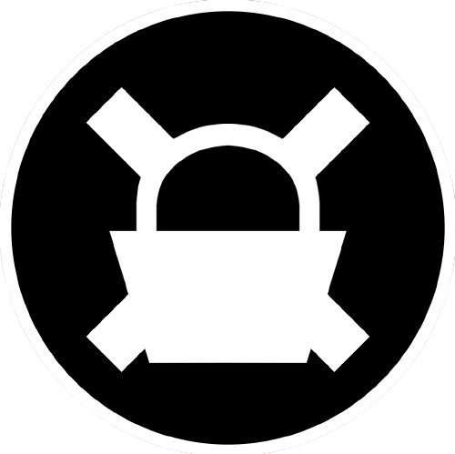

# FRAX BASKET

An Index Fund of Frax Ecosystem tokens on Fraxtal Network

A decentralised INDEX Fund Dapp, to monitor and invest in cryptocurrencies smartly.

🍎 [DEMO APP](https://frax-basket.vercel.app/)

🎞 [DEMO VIDEO](https://youtu.be/UkyukOPbDus)

## 📝 Description:

Welcome to FRAX Basket Index Fund, your gateway to one stop investment in Frax Ecosystem tokens. Frax represents a crucial protocol that integrates stablecoins, Decentralized Exchange (DEX), and Decentralized Finance (DeFi) into a unified platform. Likewise, Frax Basket allows users to invest in or swap between various coins within the FRAX ecosystem using FRAX BASKET token.

## 🔑 Key Features:

Diversification Made Easy: FRAX BASKET enables you to invest in a diversified portfolio of FRAX ecosystem token without the need for investing in each of them seperately.

### ⚠️ Risk Mitigation:

Our team of experts continuously monitors the market to adjust the composition of the basket, ensuring that your investments remain balanced and resilient to market fluctuations. This will be automated in future on be run autonomously without any intermediator.

### 🤝 User-Friendly Interface:

Whether you're a seasoned crypto enthusiast or a beginner, our intuitive interface makes investing in frax tokens as easy as a few clicks. No complex jargon, just a seamless user experience.

### 🕵️‍♀️ Transparent Performance:

Stay informed about the performance of your investment in real-time. Crypto INDEX provides detailed insights and analytics, so you always know how your portfolio is performing.

### 🔐 Security First:

We take security seriously. Crypto INDEX deploys top-notch encryption and cybersecurity measures to safeguard your assets, ensuring your peace of mind.

### 🌊 Liquidity and Accessibility:

You have the flexibility to buy and sell your FRAX BASKET holdings at any time, providing you with the liquidity you need in a fast-paced market.

### 💰 Cost-Efficient:

By investing in a diversified basket of frax ecosystem tokens, you can reduce transaction costs and minimize the impact of fees, helping you optimize your returns.

### 📕 Community and Education:

Join a thriving community of crypto enthusiasts and access educational resources to stay informed and make informed investment decisions.

## 🧺 Why Choose Crypto INDEX: Crypto Basket ?

💲 FRAX ecosystem comprises of multiple tokens:

- frxETH: eth native coin on fraxtal
- wfrxETH: wrapped eth
- sfrxETH: staked eth
- FXS: Frax share, governance token
- FRAX: stablecoin
- sFRAX: staked stablecoin
- frxBTC: fraxtal Bitcoin
- FPI: Frax Price Index, stablecoin
- FPIS: Frax Price Index Share, governance token for FPI stablecoin.

✅ FRAX BASKET currently comprises of

- 0.001 wfrxETH
- 1 FXS
- 3 FRAX

This list will be updated based on availability of Oracle prices for assets on fraxtal mainnet.

🔓 Unlock the potential of Index Fund. Either deposit component token to mint frxBASKET to invest or trade them of DEXes or buy frxBASKET from DEX and redeem to get component tokens. You can also mint/redeem frxBASKET using any of the allowed ERC20 tokens using our Net Asset Value Issuance Module.

## 📑 Smart Contracts

FRAX Basket uses Token Sets Protocol V2 under the hood as primary ecosystem of Smart Contracts.

Ecosystem Contracts

- Controller
- Set Token (ERC20) act as frxBASKET
- Integration Registry (Resource)
- Price Oracle (Resource)
- Set Valuer (Resource)
- Basic Issuance Module: Used to mind/ redeem frxBASKET with all of its components in proportionate order
- NAV Issuance Module: This module allows users to mint/ redeem using only single allowed token.
- General Index Module: This is a system contract which is used to rebalance the Fund. Only Fund Manager can start Rebalancing.

## 🚁 How it Works?

2 options to buy Frax Basket (FRXB)

### ✈️ Option 1:

- Get all the component tokens in respective ratio from Frax Swap: 0.001 wfrxETH, 1 FXS and 3 FRAX.
- Delegate assets to Frax Basket (Basic Issue Module ) using ⚡️icon
- Mint 1 FRXB by depositing assets in above ratio.

### 🚀 Option 2:

- Get any of the component token (wfrxETH, FRAX or FXS)
- Delegate asset to Frax Basket (Nav Issue Module)
- Swap assets with FRXB.

Fund rebalancing a multistep process initiated by Fund Manager.
Cli version and flow can be found in rebalance script `./smart-contracts/scripts/rebalance_script.js`

use `yarn hardhat --network mainnet run ./scripts/rebelance_script.js` to run the script after configuring the file carefully.
